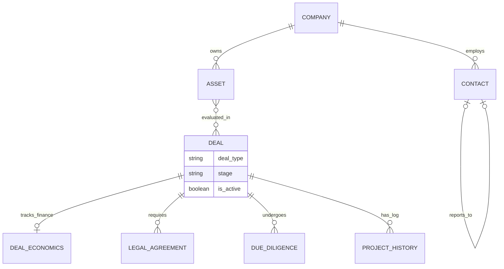

# AI-BD Tracker v1.0 - 核心架构与功能进阶设计方案

为了将 AI-BD Tracker 从一个基础的「工具」升级为「专业的医药/科技 BD 信息管理与决策支持平台」（对标 DealCloud, Inova, Salesforce for Health 等标杆产品），底层数据架构和业务逻辑必须进行升维。

目前的 `backend/models.py` 设计较好地解决了早期的信息录入问题，但针对专业 BD 流程，存在以下瓶颈：项目（Project）直接等同于交易且维度较平、缺乏财务与合同追踪体系、缺乏核心「资产（Asset）」的独立管理。

以下是针对 `backend/models.py` 及整个平台的体系化升级设计：

---

## 1. 核心架构重构：从「公司中心 (Company-centric)」向「资产与交易中心 (Asset & Deal-centric)」转变

在医药 BD 领域，交易通常围绕特定的**管线/分子/专利 (Asset)** 展开，而非单纯围绕公司。一家大药企（如 Pfizer）可能有上千个资产，我们可能只针对其中一个进行 In-licensing。

### 📌 新增模型: `Asset` (核心资产)
将 `Project` 中的管线信息抽离，使平台可以对资产进行独立画像。
- **字段建议**: `asset_name` (如 Keytruda), `modality` (分子类型: 小分子/抗体/ADC), `indication` (适应症), `development_phase` (临床前/临床一期/二期...), `moa` (作用机制), `company_id` (归属公司)。
- **关联**: `Company` 一对多拥有 `Asset`。

### 📌 模型升级: `Project` -> 改名为 `Deal` (交易项目)
BD 的核心是 Deal，Deal 是将你的公司与对方公司的 Asset 结合的过程。
- **变更**: 将 `Project` 改名为 `Deal`，支持多对多关系。一个 Deal 可以包含多个 Asset（比如买下整个肿瘤管线包）。
- **新增类型**: `deal_type` (In-licensing, Out-licensing, M&A, Joint Venture, Co-promotion)。

---

## 2. 交易经济学与估值测算 (Deal Economics & Valuation)

作为专业 BD 工具，必须能沉淀价值数据，供管理层（C-Level/Board）审批参考。不能仅仅记录联系频率，还要记录“钱”。

### 📌 新增模型: `DealEconomics`
将交易的财务架构结构化，支持内部 eNPV/rNPV 测算追踪。
- **字段建议**: 
  - `deal_id` (关联 Deal)
  - `upfront_payment` (首付款金额)
  - `milestones_total` (里程碑总计)
  - `royalties_percent` (销售分成比率)
  - `total_deal_value` (交易总额 - Bioclub / PR 常用口径)
  - `probability_of_success` (POS - 成功率评估)
  - `currency` (货币种类)

---

## 3. 专业 BD 阶段与尽调/法律合规管理 (Legal & Due Diligence)

BD 流程的卡点通常在于法务（Legal）和尽职调查（DD）。现在 `Project.stage` 是一个简单字符串，难以追踪复杂的合同状态。

### 📌 新增模型: `LegalAgreement`
记录交易的里程碑式法律文件流转，这对于保护商业机密至关重要。
- **字段建议**: 
  - `agreement_type` (CDA/NDA, Term Sheet, MTA, Definitive Agreement)
  - `status` (Drafting, Under Review, Negotiating, Executed, Expired)
  - `effective_date`, `expiration_date`
  - `attached_file_id` (关联至已有的 Attachment 表)

### 📌 新增模型: `DueDiligenceTracker`
专业 BD 会设立虚拟数据室 (VDR)。
- **字段建议**: `vdr_link`, `status` (Not Started, Ongoing, Closed), `key_risks` (JSON 格式记录 IP/Tox/CMC 等模块的红旗风险)。

---

## 4. 人脉情报图谱与 KOL 管理 (Network Intelligence Graph)

目前 `Contact` 是基于元数据的独立个人。BD 是一门“找对人”的人情生意，我们需要升维至**关系图谱 (Graph)** 级别。

### 📌 模型升级: `Contact` 社交连结增强
构建人物关系网，了解由谁引荐，组织架构是什么。
- **新增字段**: `reports_to_id` (上级领导是谁，自引用外键)，`influence_level` (决策者、执行者、内部倡导者 Champion)。
- **新增中间表 `ContactIntroductions`**: 记录 `introducer_id` (谁引荐的), `target_id` (认识了谁), `context` (在哪场会议/什么背景引荐)。

---

## 5. 日程模块彻底整合与自动化跟进 (Automated Sequences)

当前的 `Task` 过于基础，只能当做 TODO list 备忘。作为一个专业工具，需要具备**主动作战**能力。

### 📌 新增模型: `FollowUpSequence` (自动化跟进序列)
针对重点关注但暂时停滞的 Deal/Contact 进行系统级唤醒。
- **逻辑**: 如果最近一次交互 (`ProjectHistory.date`) 超过 60 天，平台自动将状态转为 `Dormant`，并自动创建“高优唤醒” Task 推荐。
- **与 AI 结合**: 模型新增 AI 缓存字段 `draft_icebreaker_email`，系统自动阅读过去3个月的 history，由 Gemini 撰写破冰邮件草稿并存入数据库，BD 登录后可一键发送。

---

## 数据库架构演进总结 (Schema Evolution Summary)

如果执行此升级，`models.py` 将经历如下结构转变：

---

## 下一步行动建议书 (Next Steps)

如果您认可这个打造“专业级医药/科技创新 BD CRM”的方向，我建议我们将它分为几个迭代（Phase）来实现，避免步子太大影响当前可用性：

1. **第一个迭代 (Asset & Deal Refactoring)**
   - 添加 `Asset` (资产) 表，并将现有 `Project` 逻辑改名为 `Deal`。
   - 使 BD 能够在一个界面管理一个药企旗下的多个管线。
2. **第二个迭代 (Legal & Valuation)**
   - 引入 NDA/Term Sheet 追踪卡片，以及财务数据侧边栏。 
3. **第三个迭代 (AI Deal Driver)**
   - 利用现有的 Gemini 接口，实现自动生成 BD 汇报文档（Management Deck）和长周期断联预警。

请审阅以上蓝图。如果符合您的野心与期望，我们可以随时挑选第一个模块开始编写代码实现升级！
